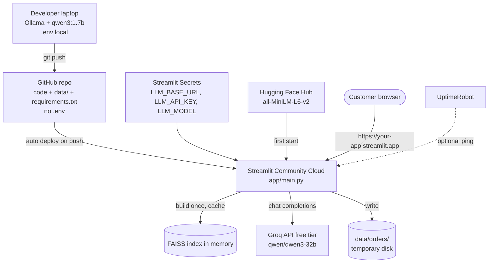

# Deployment Plan

End-to-end plan to run Store RAG Bot on free services only.

## Service map

| Need | Free service | Notes |
|---|---|---|
| Code hosting | GitHub (public or private repo) | Streamlit Cloud deploys from it |
| App hosting | Streamlit Community Cloud | Free, about 1 GB RAM, app sleeps after inactivity |
| LLM | Groq API, free tier | OpenAI-compatible, so the same code that calls Ollama locally works |
| Embeddings | `all-MiniLM-L6-v2` inside the app | Downloads from Hugging Face on first start, runs on CPU |
| Vector index | FAISS file inside the app | Built at startup and cached with `st.cache_resource` |
| Secrets | Streamlit Cloud "Secrets" | Same keys as `.env`; exposed to the app as environment variables |
| Orders | `data/orders/` on the app disk | Not persistent on Streamlit Cloud, see Limits |
| Uptime ping (optional) | UptimeRobot free plan | Wakes the app on a schedule |

Fallback app host: Hugging Face Spaces (free CPU, Docker template for Streamlit) if 1 GB RAM is not enough.

## Map



## Environments

| | Local | Deployed |
|---|---|---|
| Config source | `.env` file | Streamlit Secrets |
| `LLM_BASE_URL` | `http://localhost:11434/v1` | `https://api.groq.com/openai/v1` |
| `LLM_API_KEY` | `ollama` | Groq key (`gsk_...`) |
| `LLM_MODEL` | `qwen3:1.7b` | `qwen/qwen3-32b` (or any model listed in the Groq console) |

[config.py](config.py) reads both the same way through `os.getenv`, so no code changes between environments.

## Steps

### 1. Prepare the repo
1. Finish build steps 1 to 6 in [project.md](project.md) so `app/main.py` exists.
2. Check that `.gitignore` excludes `.env` and `.streamlit/secrets.toml`.
3. Commit `data/products/products.csv` and `data/rules/`. The app needs them at runtime.
4. Pin package versions in `requirements.txt` once the app works locally (`pip freeze`).
5. Optional: add `runtime.txt` or pick Python 3.12 in Streamlit's advanced settings.

### 2. Get the LLM key
1. Sign up at https://console.groq.com (free).
2. Create an API key. Copy it once; Groq does not show it again.
3. Check the model list in the console and pick the model name for `LLM_MODEL`.

### 3. Push to GitHub
```bash
git init
git add .
git commit -m "Store RAG Bot"
git remote add origin https://github.com/<user>/store-rag-bot.git
git push -u origin main
```

### 4. Deploy on Streamlit Community Cloud
1. Sign in at https://share.streamlit.io with GitHub.
2. New app: pick the repo, branch `main`, main file `app/main.py`.
3. Advanced settings, Secrets, paste:
   ```toml
   LLM_BASE_URL = "https://api.groq.com/openai/v1"
   LLM_API_KEY = "gsk_your_key_here"
   LLM_MODEL = "qwen/qwen3-32b"
   LLM_TEMPERATURE = "0.45"
   EMBED_MODEL = "sentence-transformers/all-MiniLM-L6-v2"
   ```
4. Deploy. The first start downloads the embedding model and builds the index (a few minutes).

### 5. Smoke test the live app
Run the step 11 conversation from project.md on the public URL: a price question, "I have back pain", add a chair, an office for 30, "done", then a warranty question with the order number.

### 6. Updates
Push to `main`. Streamlit Cloud redeploys automatically. Changing data in `data/` rebuilds the index on the next start.

## Limits of the free setup

- **Orders are not permanent.** Streamlit Cloud's disk resets on redeploy or restart, so `data/orders/` is lost. Fine for a demo. For real persistence, move orders to a free Supabase Postgres table (this matches the "move orders into SQL" item in project.md).
- **Groq rate limits.** The free tier limits requests and tokens per minute. Enough for a demo, not for heavy traffic.
- **Cold start.** The app sleeps after inactivity. The first visit wakes it up, which takes about a minute.
- **RAM.** About 1 GB. The MiniLM model plus a FAISS index of about 3,000 products fits. A larger embedding model may not.
- **Model difference.** Local uses `qwen3:1.7b`; deployed uses a larger Groq model. Re-check the "I don't know" score cutoff after deploying, since answers may differ.
- **Qwen3 reasoning text.** Qwen3 models can print `<think>...</think>` before the answer. Strip it in `gen/` in both environments.
