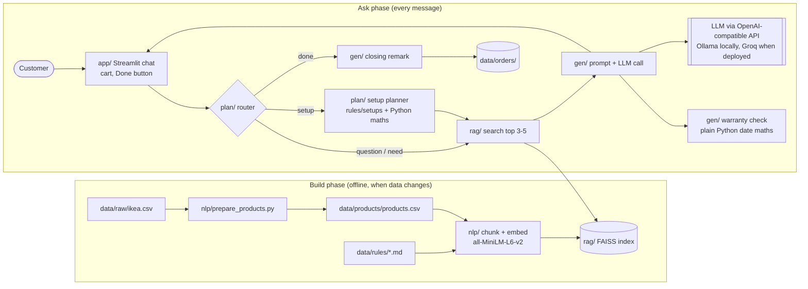

# Store RAG Bot

A chatbot for a furniture store. It answers questions from the store's own data (prices, warranty, returns), recommends products for a need and explains why they help, suggests items that go together, plans bigger setups such as "an office for 30 people", and saves the final order. If the data does not contain the answer, the bot says "I don't know".

Full build plan: [project.md](project.md). Deployment plan: [DEPLOYMENT.md](DEPLOYMENT.md).

## Status

| Step | What | State |
|---|---|---|
| 1 | Data (`data/`) | Done |
| 2 | Chunk and embed (`nlp/`) | Done |
| 3 | FAISS index and search (`rag/`) | Done |
| 4 | Answers with sources, "I don't know", not-available handling (`gen/`) | Done |
| 5 | Warranty check (`gen/warranty.py`) | Done |
| 6 | Streamlit chat page (`app/`) | Done (Version 1) |
| 7 to 11 | Benefits, cart, setup planner, orders, full run-through | To do |

## Architecture



### Products the store does not carry

When a customer asks for something not in the catalogue (for example a desk lamp or a carpet), the bot:
1. Says honestly that it is not available and that the request was passed to the team.
2. Logs the request in `data/requests/requests.csv` (time, item, question), so the store can see what people ask for.
3. Suggests the closest products it does have, with price and benefit.

How it decides: the LLM only names the product kind (temperature 0, few-shot). Python then checks whether that word appears in any product name or category. A 1.7b model cannot judge stock reliably on its own.

Key rules from the design:
- `data/` is the only place facts live. The LLM only puts retrieved facts into words.
- Low search score means "I don't know" without calling the LLM.
- All maths (warranty dates, setup quantities) is plain Python, never the LLM.

## Stack

| Part | Choice |
|---|---|
| Frontend | Streamlit |
| LLM | `qwen3:1.7b` on Ollama (local), `qwen/qwen3-32b` on Groq free tier (deployed). Same code, switched by `.env`. |
| Embeddings | `sentence-transformers/all-MiniLM-L6-v2` (CPU) |
| Vector search | FAISS |
| Config | `.env` read by [config.py](config.py) |

## Dataset

Real IKEA product data, not generated: the IKEA Saudi Arabia scrape from TidyTuesday 2020-11-03 (also on Kaggle as "IKEA SA Furniture Web Scraping"). 3,694 rows, 2,962 unique products, 17 categories, prices in SAR.

- Raw file: [data/raw/ikea.csv](data/raw/ikea.csv)
- Source: https://github.com/rfordatascience/tidytuesday/tree/master/data/2020/2020-11-03

The dataset has name, category, price and description. The extra columns project.md needs (`warranty_months`, `benefit`, `good_for`, `goes_with`) are set per category in `CATEGORY_INFO` in [nlp/prepare_products.py](nlp/prepare_products.py). The policy files in [data/rules/](data/rules/) are demo store policies.

## Run locally

Use Python 3.11 or 3.12 (`faiss-cpu` wheels may lag on newer versions).

```bash
python -m venv .venv
.venv\Scripts\activate          # Windows; use source .venv/bin/activate on macOS/Linux
pip install -r requirements.txt
ollama pull qwen3:1.7b
cp .env.example .env            # defaults point at local Ollama
python nlp/prepare_products.py  # rebuild data/products/products.csv
```

```bash
python -m rag.index             # build the FAISS index (also built automatically on first run)
streamlit run app/main.py       # chat page at http://localhost:8501
```

## Tests

```bash
python -m gen.warranty          # warranty date edge cases
python -m tests.scenarios       # 18 end-to-end chat scenarios against the real index and LLM
python -m tests.scenarios 3     # same, 3 rounds each to catch flaky LLM output
```

On CPU with `qwen3:1.7b`, each reply takes about 10 to 30 seconds (two LLM calls: product check and answer).

## Configuration

All settings are environment variables. See [.env.example](.env.example).

| Variable | Meaning |
|---|---|
| `LLM_BASE_URL` | OpenAI-compatible endpoint (Ollama or Groq) |
| `LLM_API_KEY` | API key (`ollama` for local) |
| `LLM_MODEL` | Model name |
| `LLM_TEMPERATURE` | 0.4 to 0.5 |
| `LLM_REASONING_EFFORT` | `none` turns Qwen3 thinking off (about 30x faster) |
| `EMBED_MODEL` | Sentence-transformers model |

`.env` is git-ignored. Never commit keys.
