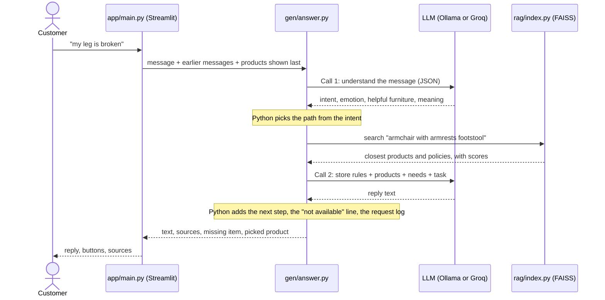
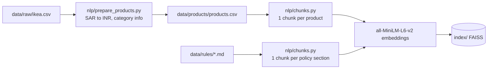

# Store RAG Bot

A chat assistant for a furniture store that answers only from the store's own data and helps customers find, and buy, furniture that suits their situation.

Customers rarely ask for a product by name. They say "my leg is broken" or "we're expecting a baby". A plain search on those words finds table legs and baby-shaped nothing. This bot first works out what the customer means, then searches for the furniture that helps, and answers with real prices and policies from the catalogue. If the data does not contain the answer, it says "I don't know" instead of guessing.

## Features

- **Understands the situation**: reads intent, feeling and needs from each message, and remembers the last 3 messages.
- **Empathy first**: sympathy for a problem, congratulations for good news, then up to 3 products and how each one helps.
- **Facts only from the data**: prices in ₹, warranty lengths and policies come from `data/`, never from the model's memory.
- **Honest about stock**: "Sorry, laptop is not available in our store right now", logs the request for the store, and suggests the closest match.
- **Guides the purchase**: "the second one" or "I'll take the HATTEFJÄLL" shows the exact product facts and next-step buttons.
- **Warranty check**: from a purchase date, Python works out whether the item is still covered.
- **Runs locally or free in the cloud**: Ollama on your machine, or Groq's free tier when deployed. Same code.

## How it works

### One message, start to finish



The model never decides on its own. It describes the message (call 1) and puts retrieved facts into words (call 2). Python does the routing, the stock check, the maths and the clean-up in between.

### The same example, step by step

**1. Understand (LLM call 1).** [gen/answer.py](gen/answer.py) `understand()` sends the message, with the last 3 earlier messages, to the model at temperature 0 in JSON mode, with few-shot examples. For "my leg is broken" it returns:

```json
{"intent": "PRODUCT_RECOMMENDATION", "item": "", "problem": "broken leg", "emotion": "pain",
 "sentiment": "negative", "furniture": ["recliner", "armchair with armrests", "footstool"],
 "constraints": [], "meaning": "Needs comfortable seating that supports the leg while recovering."}
```

**2. Route (Python).** `answer()` checks the labels first. "The leg of my table snapped" is about furniture, so it becomes a complaint, not an injury. Then it picks a path:

| Intent | Path |
|---|---|
| `PRODUCT_RECOMMENDATION` | Search the helpful `furniture`, not the problem words ("leg" would find table legs). Spare parts are dropped. |
| `PRODUCT_SEARCH`, `PRODUCT_COMPARISON` | Search the question. Check whether the `item` is sold. |
| `PURCHASE` | Find the product the customer means. Show its exact facts and next-step buttons. |
| `STORE_INFORMATION`, `ORDER_SUPPORT`, `COMPLAINT` | Use policy sections only. |
| `CASUAL_CONVERSATION` | A short friendly reply, with no search and no store facts. |
| `GENERAL_QUESTION` | "I don't know", with no second LLM call. |

**3. Retrieve.** [rag/index.py](rag/index.py) `search()` embeds the text with `all-MiniLM-L6-v2` and returns the top 5 chunks plus the top 2 policy sections, each with a cosine score. Policies are searched separately so about 3,000 products cannot crowd them out. If the best score is below 0.30, the reply is "I don't know" and the model is not called again.

**4. Check stock.** `is_missing()` compares the main noun of the request with the main noun of every product type. A "Laptop table" is a table, so the store does not sell laptops.

**5. Answer (LLM call 2).** The prompt holds the store rules (answer only from the context, quote prices exactly, no medical promises, never invent discounts or deadlines), the retrieved chunks, what the customer needs, and a task such as "start with one warm sentence of sympathy". Temperature is 0.8 for products and 0.3 for policy answers.

**6. Clean up and show.** Python adds the "not available" line and logs the request to `data/requests/requests.csv`, removes any copied template text, and ends every product list with "Would you like one of these? Tell me the number". [app/main.py](app/main.py) shows the reply, a "Request noted" note, next-step buttons after a purchase choice, and a Sources panel with scores, links and prices.

The reply the customer sees (from a real run, shortened):

> Hello! I'm sorry to hear you're feeling pain, especially with your leg. Here are some products that could help:
> 1. **INGATORP - Chair with armrests** – ₹10,458. This chair provides support and comfort for long hours, which could help you stay seated while recovering.
> 2. **REMSTA - Armchair** – ₹18,682. ...
>
> Would you like one of these? Tell me the number and I'll share the full details.

### LLM calls per message

| Message | Calls |
|---|---|
| Off-topic, or nothing in the data matches | 1 |
| Product question, described need, policy question, chit-chat, picking a product | 2 |
| Warranty check with a purchase date (date maths in [gen/warranty.py](gen/warranty.py)) | 1 |

### Build phase (once, when the data changes)



## Quick start

Prerequisites: Python 3.11 or 3.12 (`faiss-cpu` wheels may lag on newer versions) and [Ollama](https://ollama.com).

```bash
git clone https://github.com/TusharParlikar/Store-RAG-Bot.git
cd Store-RAG-Bot
python -m venv .venv
.venv\Scripts\activate          # Windows; use source .venv/bin/activate on macOS/Linux
pip install -r requirements.txt
ollama pull qwen3:1.7b
cp .env.example .env            # defaults point at local Ollama
streamlit run app/main.py
```

Open http://localhost:8501. The first start builds the FAISS index and downloads the embedding model, which takes a minute or two.

To rebuild from the raw data: `python nlp/prepare_products.py`, then `python -m rag.index`.

## Configuration

All settings are environment variables, read by [config.py](config.py). See [.env.example](.env.example).

| Variable | Required | Default | Purpose |
|---|---|---|---|
| `LLM_BASE_URL` | no | `http://localhost:11434/v1` | OpenAI-compatible endpoint (Ollama or Groq) |
| `LLM_API_KEY` | no | `ollama` | API key; set `<YOUR_GROQ_API_KEY>` for Groq |
| `LLM_MODEL` | no | `qwen3:1.7b` | Model name (`qwen/qwen3-32b` on Groq) |
| `LLM_TEMPERATURE` | no | `0.8` | Warmth of product replies (understanding uses 0, policy answers 0.3) |
| `LLM_REASONING_EFFORT` | no | `none` | `none` turns Qwen3 thinking off (about 30x faster) |
| `EMBED_MODEL` | no | `sentence-transformers/all-MiniLM-L6-v2` | Embedding model |

`.env` is git-ignored. Never commit keys. Deployment steps: [DEPLOYMENT.md](DEPLOYMENT.md).

## Stack

| Part | Choice |
|---|---|
| Frontend | Streamlit |
| LLM | `qwen3:1.7b` on Ollama (local), `qwen/qwen3-32b` on Groq free tier (deployed). Same code, switched by `.env`. |
| Embeddings | `sentence-transformers/all-MiniLM-L6-v2` (CPU) |
| Vector search | FAISS |
| Config | `.env` read by [config.py](config.py) |

## Dataset

Real IKEA product data, not generated: the IKEA Saudi Arabia scrape from TidyTuesday 2020-11-03 (also on Kaggle as "IKEA SA Furniture Web Scraping"). 3,694 rows, 2,962 unique products, 17 categories. Raw prices are in SAR; [nlp/prepare_products.py](nlp/prepare_products.py) converts them to INR at `SAR_TO_INR` (23.5) and keeps the original in `price_sar`.

- Raw file: [data/raw/ikea.csv](data/raw/ikea.csv)
- Source: https://github.com/rfordatascience/tidytuesday/tree/master/data/2020/2020-11-03

The dataset has name, category, price and description. The extra columns project.md needs (`warranty_months`, `benefit`, `good_for`, `goes_with`) are set per category in `CATEGORY_INFO` in [nlp/prepare_products.py](nlp/prepare_products.py). The policy files in [data/rules/](data/rules/) are demo store policies.

## Tests

```bash
python -m gen.warranty          # warranty date edge cases
python -m tests.scenarios       # 22 end-to-end chat scenarios against the real index and LLM
python -m tests.scenarios 3     # same, 3 rounds each to catch flaky LLM output
```

On CPU with `qwen3:1.7b`, each reply takes about 10 to 30 seconds (two LLM calls: product check and answer).
