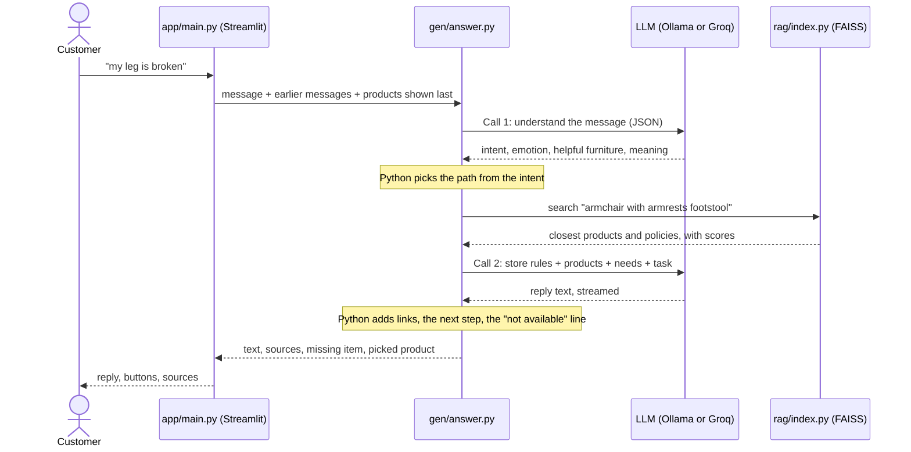

# Store RAG Bot

A chat assistant for a furniture store. It answers only from the store's own data and helps customers find, and buy, furniture that suits their situation.

Customers rarely ask for a product by name. They say "my leg is broken" or "we're expecting a baby", and a plain search on those words finds table legs. This bot first works out what the customer means, then searches for furniture that helps, and answers with real prices and policies from the catalogue. If the data does not hold the answer, it says "I don't know".

**Docs:** [how it works](docs/ARCHITECTURE.md) · [how to deploy](docs/DEPLOY.md)

## Example

> **Customer:** my leg is broken
>
> **Bot:** Hello! I'm sorry to hear you're feeling pain, especially with your leg. Here are some products that could help:
> 1. **INGATORP - Chair with armrests** – ₹10,458. This chair provides support and comfort for long hours, which could help you stay seated while recovering.
> 2. **REMSTA - Armchair** – ₹18,682. ...
>
> Would you like one of these? Tell me the number and I'll add it to your cart.
>
> **Customer:** 1
>
> **Bot:** *(a short description, then)* Price: ₹10,458 · Warranty: 60 months (5 years) · Product page link
>
> 🛒 Added to your cart (1 item, total ₹10,458). Tell me what else you need, or say **check out** when you are done.
>
> **Customer:** check out
>
> **Bot:** Here is your order (1 item, total ₹10,458): 1. INGATORP - Chair with armrests *(link)* – ₹10,458

Replies are from real runs, shortened.

## Features

- **Understands the situation**: reads intent, feeling and needs from each message and remembers the last 3 messages.
- **Empathy, once**: sympathy for a problem or congratulations for good news, then up to 3 products and how each helps.
- **Facts only from the data**: prices in ₹, warranty lengths and policies come from `data/`, never from the model's memory.
- **Honest about stock**: says when a product is not sold, logs the request for the store, and suggests the closest match.
- **Cart and checkout**: the bot opens by asking what you need. "2", "1st", "the first and the third", "the cheapest one" or "I'll take the HATTEFJÄLL" adds products to a cart. Keep shopping, remove items, then say "check out" to get the list with a link to each product page and the total.
- **Direct links**: name a product ("How much is the MALM bed?") and the reply ends with links to its product pages.
- **Warranty checker**: type a product and a purchase date in the sidebar, and Python works out whether it is still covered and until which day. No model is involved, so it always answers.
- **Local or hosted model**: Ollama on your machine, or any OpenAI-compatible API such as Groq. Same code.

## Quick start

Prerequisites: Python 3.11 or newer (developed on 3.14) and [Ollama](https://ollama.com).

```bash
git clone https://github.com/TusharParlikar/Store-RAG-Bot.git
cd Store-RAG-Bot
python -m venv .venv
.venv\Scripts\activate          # Windows; use source .venv/bin/activate on macOS/Linux
pip install -r requirements.txt
ollama pull qwen3:1.7b
cp .env.example .env            # defaults point at local Ollama
streamlit run app/main.py
```

Open http://localhost:8501. The first start downloads the embedding model, builds the search index and loads the LLM, which takes a few minutes on a laptop.

## How it works



1. **Understand.** One LLM call describes the message as JSON: intent, feeling, the furniture that would help.
2. **Route.** Python picks the path: recommend, search, purchase, policy, chit-chat or "I don't know".
3. **Retrieve.** The question, or the helpful furniture, is searched in a FAISS index of products and policy sections.
4. **Answer.** A second LLM call writes the reply from the retrieved facts only.
5. **Clean up.** Python adds the stock notice, product links and a next step.

The model never decides on its own: it describes the message and puts facts into words, and Python does the rest. Full detail, including the intent table and the build phase, is in [docs/ARCHITECTURE.md](docs/ARCHITECTURE.md).

## Configuration

All settings are environment variables, read by [config.py](config.py). See [.env.example](.env.example).

| Variable | Required | Default | Purpose |
|---|---|---|---|
| `LLM_BASE_URL` | no | `http://localhost:11434/v1` | OpenAI-compatible endpoint (Ollama or Groq) |
| `LLM_API_KEY` | no | `ollama` | API key; set `<YOUR_GROQ_API_KEY>` for Groq |
| `LLM_MODEL` | no | `qwen3:1.7b` | Model name (`qwen/qwen3-32b` on Groq) |
| `LLM_TEMPERATURE` | no | `0.8` | Warmth of product replies (understanding uses 0, policy answers 0.3) |
| `LLM_REASONING_EFFORT` | no | `none` | `none` turns Qwen3 thinking off; use `low` for models that reject `none` |
| `LLM_KEEP_ALIVE` | no | `2h` for a local endpoint, otherwise unset | How long Ollama keeps the model loaded |
| `EMBED_MODEL` | no | `sentence-transformers/all-MiniLM-L6-v2` | Embedding model |

`.env` is git-ignored. Never commit keys.

## Project structure

```
app/main.py              the chat loop: take a message, get the answer, show it
app/ui.py                page look, sidebar (cart with remove buttons, warranty checker), buttons under a reply
gen/answer.py            the steps of one answer, in order; the only entry point
gen/understand.py        read the message (LLM call 1) and correct its labels
gen/picking.py           which product "the second one" or "the cheapest" means
gen/catalogue.py         stock check, product names, product page links
gen/llm.py               the one function that calls the model
gen/prompts.py           all prompt text
gen/cart.py              cart: add, show, remove, check out (no LLM)
gen/warranty.py          warranty date maths in plain Python
rag/index.py             build the FAISS index and search it
nlp/chunks.py            chunking, embeddings, rupee formatting
nlp/prepare_products.py  raw IKEA file to the product table
data/raw/                downloaded dataset
data/products/           product table used by the bot
data/rules/              warranty, returns and expiry policies (demo policies)
tests/checks.py          fast checks of the plain-Python parts, no LLM
tests/scenarios.py       single-message chat scenarios
tests/shopping.py        whole shopping trips: ask, add, remove, check out
docs/                    architecture and deployment notes
config.py                settings from environment variables
```

## Tests

```bash
python -m gen.warranty          # warranty date edge cases
python -m tests.checks          # fast checks, no LLM: picking, cart, stock words, product names
python -m tests.scenarios       # 77 chat scenarios against the real index and LLM
python -m tests.shopping        # 5 shopping trips, 26 turns, with the cart carried between turns
```

The scenarios cover prices, policies, needs and feelings, products not sold, off-topic questions, chit-chat, complaints, memory, picking a product and named-product links. On the local `qwen3:1.7b` model the shopping trips pass 26 of 26, and the 77 scenarios pass 75 of 77. On Groq (`openai/gpt-oss-120b`) the shopping trips pass 26 of 26; the 77 scenarios have not completed there, because the free daily token limit ran out.

## Data

Real IKEA product data, not generated: the IKEA Saudi Arabia scrape from [TidyTuesday 2020-11-03](https://github.com/rfordatascience/tidytuesday/tree/master/data/2020/2020-11-03), with 2,962 unique products in 17 categories. Prices are converted from SAR to INR at a fixed rate (`SAR_TO_INR` = 23.5). The dataset has no warranty, benefit or pairing columns, so these are set per category in `CATEGORY_INFO` in [nlp/prepare_products.py](nlp/prepare_products.py). The store name and the policies in [data/rules/](data/rules/) are made up for the demo, and product links go to IKEA's site.

To rebuild from the raw file: `python nlp/prepare_products.py`, then `python -m rag.index`.

## Limitations

With the local `qwen3:1.7b` model on a laptop CPU (i5-1335U, no GPU):
- **Slow.** The first words of a reply appear after 20 to 35 seconds, and a full reply takes 25 to 55 seconds.
- **Small-model slips.** It sometimes skips the requested opening, drifts towards health wording ("pain relief") despite the comfort-only rule, or answers a complaint with the return policy instead of the warranty route.
- **No payment.** Checkout hands over product page links; the bot does not take orders or money, and the cart lives only in the browser session.
- **Free hosted limits.** A message costs about 3,400 tokens, mostly the long understanding prompt. Groq's free tier for `openai/gpt-oss-120b` allows 200,000 tokens a day, which is about 60 messages.

A hosted model is much faster: on Groq, `openai/gpt-oss-120b` answers in 1 to 3 seconds. It needs `LLM_REASONING_EFFORT=low`, because it rejects `none`.

## Roadmap

Not built yet:
- Suggestions for what goes with the items in the cart.
- A planner for bigger setups such as "an office for 30 people".
- Saving the final order with an order number.
- Deployment: the plan is in [docs/DEPLOY.md](docs/DEPLOY.md).

## License

No license file yet.
