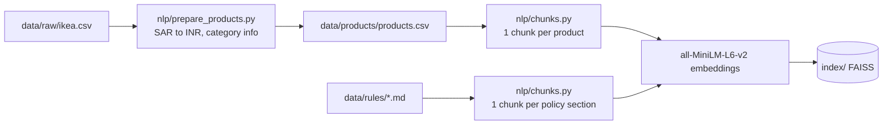
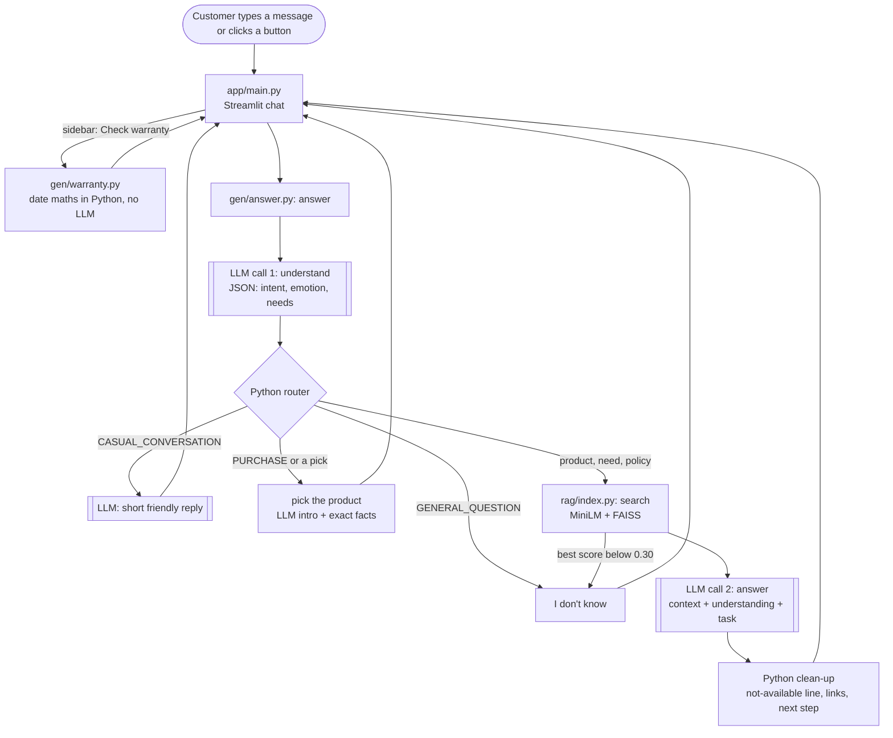

# Architecture

How Store RAG Bot turns a customer message into a reply. For setup and an overview, see the [README](../README.md).

## Design rules

- **Facts live only in `data/`.** The model puts retrieved facts into words. It does not supply prices, warranty lengths or policies from memory.
- **The model describes, Python decides.** The first LLM call labels the message. Routing, the stock check, picking a product and all maths are plain Python.
- **A weak match means "I don't know".** If nothing in the data is close to the question, the bot says so without a second LLM call.
- **Honest selling.** No invented discounts, stock limits or deadlines, and no medical promises.

## Where the code lives

`gen/answer.py` is the only entry point: `answer()` runs the steps below in order and each step is one short function or one module.

| File | Job |
|---|---|
| `app/main.py` | The chat loop: take a message, call `answer()`, show the reply |
| `app/ui.py` | Page look, sidebar, buttons under a reply |
| `gen/answer.py` | The steps of one answer |
| `gen/understand.py` | LLM call 1 and the label fixes |
| `gen/picking.py` | Which product the customer means |
| `gen/catalogue.py` | Stock check, product names, links |
| `gen/cart.py` | Cart and checkout |
| `gen/prompts.py` | All prompt text |
| `gen/llm.py` | The one function that calls the model |
| `gen/warranty.py` | Warranty date maths |
| `rag/index.py`, `nlp/chunks.py` | Search index, chunks and embeddings |

## Build phase (once, when the data changes)



The index is built on the first search if `index/` is missing, or by `python -m rag.index`.

## Ask phase (every message)



### 1. Input: `app/main.py`

Takes the typed message, or the text of a clicked next-step button. It passes along the customer's earlier messages and the products listed in the bot's last reply.

The sidebar has two things that never reach the model. The **warranty checker** takes a product and a purchase date; [gen/warranty.py](../gen/warranty.py) works out the last covered day and the answer goes straight into the chat. The **cart** has a remove button next to every product. A chat message that asks whether something is still under warranty gets a normal answer plus a pointer to the checker, because the bot cannot know the purchase date.

### 2. Understand (LLM call 1): `gen/understand.py`

Temperature 0, JSON mode, few-shot examples from [gen/prompts.py](../gen/prompts.py). The model sees the message and the last 3 earlier messages. For "my leg is broken" it returns:

```json
{"intent": "PRODUCT_RECOMMENDATION", "item": "", "problem": "broken leg", "emotion": "pain",
 "sentiment": "negative", "furniture": ["recliner", "armchair with armrests", "footstool"],
 "constraints": [], "meaning": "Needs comfortable seating that supports the leg while recovering."}
```

Broken or unknown JSON falls back to a plain search with the score cutoff.

### 3. Correct and route

`read_message()` in `gen/understand.py` fixes two labels the small model gets wrong: "the leg of my table snapped" becomes a complaint (furniture broke, not a leg), and a flood at home is not a complaint about something the store sold.

| Intent | Path |
|---|---|
| `PRODUCT_RECOMMENDATION` | Search the helpful `furniture`, not the problem words ("leg" would find table legs). Spare parts are dropped. |
| `PRODUCT_SEARCH`, `PRODUCT_COMPARISON` | Search the question. Check whether the `item` is sold. |
| `PURCHASE`, a buying phrase after a list, or a wish to buy a named product | Find the product or products the customer means and add them to the cart. One product: show its facts, a product page link and next-step buttons. |
| `STORE_INFORMATION`, `ORDER_SUPPORT`, `COMPLAINT` | Policy sections only. Complaints see only the warranty and returns policies. |
| `CASUAL_CONVERSATION` | A short friendly reply with no search and no store facts. |
| `GENERAL_QUESTION` | "I don't know", with no second LLM call. |

**Which products were listed** (`listed()` in `gen/picking.py`): the products of the last reply, in the order the reply shows them. The model reorders search results, so "the second one" must follow the text, not the search rank.

**Is it a pick?** Three signs, any one is enough: the model says `PURCHASE`; a buying phrase follows a list ("the second one", "2"); or the customer wants to buy a product they name ("I want to buy the POÄNG rocking-chair"). The last two are plain Python, because the small model often misses them.

**Picking** (`pick_products()`): several at once ("the first and the third", "both"), otherwise one: a product name first ("the HATTEFJÄLL"), then "cheapest", "most expensive" or "the last one", then a position ("2", "1st", "the second one", "number 3"). If several products were listed and none of these match, the bot asks which one.

### 4. Retrieve: `search()` in `rag/index.py`

Embeds the text and returns the top 5 chunks plus the top 2 policy sections, each with a cosine score. Policies are searched separately so about 3,000 products cannot crowd them out. Repeated products (same name and price) are dropped, and at most 4 chunks go to the answer call. If the best score is below 0.30 and no product is named, the reply is "I don't know".

### 5. Check stock: `is_missing()` in `gen/catalogue.py`

Compares the main noun of the request with the main noun of every product type and with the category names. A "Laptop table" is a table, so the store does not sell laptops. A few synonyms are mapped (crib to cot, almirah to wardrobe).

### 6. Answer (LLM call 2)

The prompt holds the store rules, the retrieved chunks, what the customer needs (not for policy answers), and a task such as "start with one warm sentence of sympathy". Sympathy or congratulations is said once: on a follow-up message the bot goes straight to the products. Temperature is 0.8 for products and 0.3 for policy answers. The reply is streamed to the page as it is written.

### 7. Clean up and show

Python then:
- adds the "not available" line and logs the request to `data/requests/requests.csv`,
- removes copied template text and the model's own closing question,
- adds **Product pages** links for products the customer named ("How much is the MALM bed?"). Names that are also everyday words ("LACK", "HALLO") count only when typed in capitals,
- ends every product list with "Would you like one of these? Tell me the number and I'll add it to your cart".

`app/main.py` shows the reply, a "Request noted" note, next-step buttons after a pick, and a Sources panel with scores, links and prices.

## Cart and checkout: `gen/cart.py`

The chat page opens with a welcome message that asks what the customer needs. The cart is a list of products kept in the browser session and passed to `answer()` with every message.

Before any LLM call, `command()` checks whether the message is about the cart itself:

| Message | Result |
|---|---|
| "check out", "place my order", or "that's all" / "I'm done" with items in the cart | The order: every item with its product page link, and the total. The cart is emptied. |
| "show my cart" | The items and the total |
| "remove 2", "remove the MALM" | That item is removed |
| "empty my cart" | Everything is removed |

A pick adds to the cart and the reply ends with the cart size and total. The same product is not added twice. The sidebar shows the cart and a Check out button. There is no payment step: checkout hands over the links.

## LLM calls per message

| Message | Calls |
|---|---|
| Off-topic, or nothing in the data matches | 1 |
| Product question, described need, policy question, chit-chat, picking a product | 2 |
| "I'll take that one" when several were listed (the bot asks which) | 1 |
| The sidebar warranty checker, and the cart's remove buttons | 0 |
| Cart commands: check out, show, remove, empty | 0 |

## Speed

Measured on a laptop CPU (i5-1335U, no GPU) with `qwen3:1.7b`: the model reads about 50 tokens/s and writes 11 to 16 tokens/s. Search takes under 0.5 s. To keep waits down, the app loads the model and caches the long understanding prompt at start, keeps the model loaded for 2 hours (`LLM_KEEP_ALIVE`), sends at most 4 chunks to the answer call, and streams the reply.
