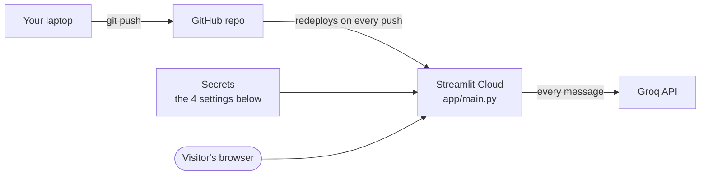

# Deploy

How to put Store RAG Bot online for free: the app on Streamlit Community Cloud, the language model on Groq.

> [!WARNING]
> These steps have not been run end to end yet. The app works locally with both Ollama and Groq; the hosting part is written from the two services' documented behaviour. Section 6 lists what is most likely to need fixing.

## 1. What goes where

| Part | Where it runs | Cost |
|---|---|---|
| Chat page, search index, embedding model | Streamlit Community Cloud | Free, about 1 GB of memory, sleeps when unused |
| Language model | Groq API | Free tier, with a daily token limit |
| Code and data | Your GitHub repo | Free |



The language model cannot run on Streamlit Cloud itself: there is no Ollama there. That is why the deployed app needs a hosted model.

## 2. Before you start

- The code is pushed to GitHub (`main` branch).
- `.env` is **not** in the repo. Check with `git ls-files | grep .env`: only `.env.example` may show.
- You have a Groq account and an API key: sign up at https://console.groq.com, then **API Keys → Create API Key**. Copy it at once; Groq shows it only one time.

## 3. Try the hosted model on your laptop first

This catches a wrong key or model name before you deploy. Put these in `.env`:

```bash
LLM_BASE_URL=https://api.groq.com/openai/v1
LLM_API_KEY=<YOUR_GROQ_API_KEY>
LLM_MODEL=openai/gpt-oss-120b
LLM_REASONING_EFFORT=low
```

Then run `streamlit run app/main.py` and ask one question.

`LLM_REASONING_EFFORT` must be `low` for `openai/gpt-oss-120b`. With the default `none`, Groq rejects every request with `reasoning_effort must be one of low, medium, or high`.

## 4. Deploy

1. Go to https://share.streamlit.io and sign in with GitHub.
2. Click **Create app**, then **Deploy a public app from GitHub**.
3. Fill in:
   - **Repository:** `TusharParlikar/Store-RAG-Bot`
   - **Branch:** `main`
   - **Main file path:** `app/main.py`
4. Open **Advanced settings**:
   - **Python version:** 3.12
   - **Secrets:** paste this, with your real key:
     ```toml
     LLM_BASE_URL = "https://api.groq.com/openai/v1"
     LLM_API_KEY = "<YOUR_GROQ_API_KEY>"
     LLM_MODEL = "openai/gpt-oss-120b"
     LLM_REASONING_EFFORT = "low"
     ```
5. Click **Deploy**.

The first start takes several minutes: it installs the packages, downloads the embedding model and builds the search index from `data/`. The page shows "Loading the store catalogue and waking the assistant..." while it works.

Secrets become environment variables inside the app, and [config.py](../config.py) reads them the same way it reads `.env`. No code change is needed.

## 5. Check the live app

Try each of these on the public URL:

| Type this | You should see |
|---|---|
| `How much is the NORDVIKEN bar table?` | A price in ₹ and product page links |
| `my back hurts after sitting all day` | Sympathy, then up to 3 products |
| `1` | The product's facts, and "Added to your cart" |
| `check out` | The order with a link for each product, and an empty cart |
| `What is your return window?` | 365 days |
| `do you sell laptops?` | "Not available", then close alternatives |
| Sidebar: turn on the purchase date, then `is my MARKUS office chair still under warranty?` | Covered or expired, with the last covered day |

To update the app later, push to `main`. Streamlit Cloud redeploys by itself.

## 6. Known limits and likely problems

- **Daily token limit.** One message uses about 3,400 tokens, most of it the long understanding prompt. Groq's free tier for `openai/gpt-oss-120b` allows 200,000 tokens a day, so about 60 messages. After that every reply is "Sorry, I can't reach the language model right now (RateLimitError)" until the limit resets. Every app start also spends one message on the warm-up.
- **Memory.** The embedding model needs PyTorch, which is large. If the build fails or the app is killed for memory, add this as the **first line** of `requirements.txt` so the smaller CPU-only build is installed, then push:
  ```
  --extra-index-url https://download.pytorch.org/whl/cpu
  ```
- **Package versions.** `requirements.txt` pins the versions tested on this laptop with Python 3.14. If Streamlit Cloud cannot install one of them on Python 3.12, remove the `==version` from that line.
- **Cold start.** After a while without visitors the app sleeps. The next visitor waits about a minute while it wakes up.
- **Nothing is saved.** The cart lives in the visitor's browser session. The request log (`data/requests/requests.csv`) is lost whenever the app restarts.
- **Tuned on another model.** The prompts and the 0.30 "I don't know" cutoff were tuned on `qwen3:1.7b`. On Groq the shopping tests pass (26 of 26 turns); the full 77 scenarios have not completed there.
- **Public app, your key.** Anyone with the link spends your Groq tokens. Do not share the URL more widely than you mean to.

## 7. Settings reference

| Setting | Local (Ollama) | Deployed (Groq) |
|---|---|---|
| `LLM_BASE_URL` | `http://localhost:11434/v1` | `https://api.groq.com/openai/v1` |
| `LLM_API_KEY` | `ollama` | `<YOUR_GROQ_API_KEY>` |
| `LLM_MODEL` | `qwen3:1.7b` | `openai/gpt-oss-120b` |
| `LLM_REASONING_EFFORT` | `none` | `low` |
| `LLM_KEEP_ALIVE` | `2h` (default) | leave unset |
