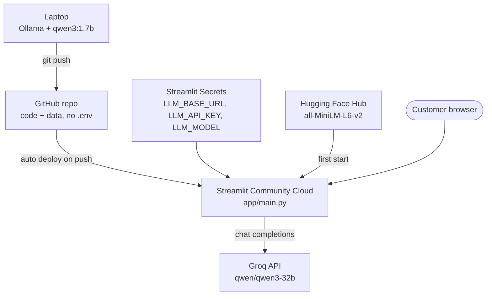

# Deployment

A plan for running Store RAG Bot on free services. It has not been deployed yet, so treat the steps as untested.

## Services

| Need | Free service | Notes |
|---|---|---|
| Code hosting | GitHub | Streamlit Cloud deploys from the repo |
| App hosting | Streamlit Community Cloud | About 1 GB RAM; the app sleeps after inactivity |
| LLM | Groq API, free tier | OpenAI-compatible, so the code that calls Ollama locally works unchanged |
| Embeddings | `all-MiniLM-L6-v2` inside the app | Downloaded from Hugging Face on first start, runs on CPU |
| Vector index | FAISS inside the app | Built on first start from `data/` |
| Secrets | Streamlit Cloud "Secrets" | Same names as `.env` |



## Local and deployed settings

| | Local | Deployed |
|---|---|---|
| Config source | `.env` file | Streamlit Secrets |
| `LLM_BASE_URL` | `http://localhost:11434/v1` | `https://api.groq.com/openai/v1` |
| `LLM_API_KEY` | `ollama` | `<YOUR_GROQ_API_KEY>` |
| `LLM_MODEL` | `qwen3:1.7b` | `qwen/qwen3-32b` (or another model from the Groq console) |

[config.py](../config.py) reads both through environment variables, so the code does not change. `LLM_KEEP_ALIVE` is sent only to a local endpoint.

## Steps

1. **Get a Groq key.** Sign up at https://console.groq.com and create an API key.
2. **Deploy.** Sign in at https://share.streamlit.io with GitHub. New app: this repo, branch `main`, main file `app/main.py`. Pick Python 3.12 in the advanced settings.
3. **Add secrets** in the advanced settings:
   ```toml
   LLM_BASE_URL = "https://api.groq.com/openai/v1"
   LLM_API_KEY = "<YOUR_GROQ_API_KEY>"
   LLM_MODEL = "qwen/qwen3-32b"
   ```
4. **First start.** The app downloads the embedding model and builds the index. Allow a few minutes.
5. **Check it.** Ask a price, describe a problem ("my back hurts"), pick a product by number, ask a policy question, and ask for something not sold.
6. **Update.** Push to `main`; Streamlit Cloud redeploys. Changed files in `data/` are picked up when the index is rebuilt on the next start.

## Limits of the free setup

- **The request log is not permanent.** Streamlit Cloud's disk resets on restart, so `data/requests/requests.csv` is lost.
- **Groq rate limits.** The free tier limits requests and tokens per minute. Enough for a demo.
- **Cold start.** The app sleeps after inactivity; the first visit takes about a minute.
- **RAM.** About 1 GB. MiniLM plus an index of about 3,000 products should fit; a larger embedding model may not.
- **Different model.** The prompts and the 0.30 score cutoff were tuned on `qwen3:1.7b`. Run `python -m tests.scenarios` against Groq before relying on it.
- **Unpinned packages.** `requirements.txt` has no versions. Pin them (`pip freeze`) before deploying.
